# 文档生成视频自动化工作流 — 技术方案书

> **版本:** v0.2.1(文本级修订)
> **日期:** 2026-08-27
> **状态:** 已过两轮 gpt-5.6-sol 评审;本轮修订关闭全部文本级阻断项(H-01~H-10 中可文本关闭项);**架构级 P0 项(契约提交、FAL 冻结、真实 smoke)依赖 M0 产物关闭,完成后提交 v0.3 复审**
> **评审记录:** 见附录 D(一审:`review_report.md`;二审:`review_report_v02.md`)
> **目标读者:** 实现者(本文档 + 仓库内契约/Prompt/样例 **随 M0 逐步提交** 后共同构成开发依据;在资产提交前,未提交项一律视为计划)

**目标:** 构建一条"文档 → 视频"的全自动流水线:输入一份文档(PDF/Word/Markdown/TXT),无人值守输出一条带口播、配图、字幕的成片(MP4),失败关停、不产出"伪成功"。

**架构:** 10 阶段流水线(P0–P9),阶段产物**不可变、原子提交、可独立重跑**;数据契约由 **Pydantic 模型 + Draft 2020-12 JSON Schema** 双保险驱动(M0 提交);断点续跑是**崩溃安全 + 并发安全**的状态机,含全量重验与 request 级恢复。

**技术栈:** Python 3.11 + uv · PyMuPDF/python-docx(解析)· Ollama Qwen3:14b + 云 API(LLM,结构化输出)· edge-tts(语音,含边界时间戳)· FAL(图像,**唯一端点待 M0 Spike 冻结**)· ffmpeg(合成,参数数组+横竖屏参数化)· faster-whisper(ASR 回读兜底)· asyncio 编排。

---

## 目录

1. [项目概述](#1-项目概述)
2. [需求分析](#2-需求分析)
3. [总体架构](#3-总体架构)
4. [模块详细设计](#4-模块详细设计)
5. [技术选型](#5-技术选型)
6. [数据契约与中间产物](#6-数据契约与中间产物)
7. [编排与自动化](#7-编排与自动化)
8. [开发计划](#8-开发计划)
9. [质量保障与验收](#9-质量保障与验收)
10. [风险与对策](#10-风险与对策)
11. [附录](#11-附录)

---

## 1. 项目概述

### 1.1 背景与目标

将文档内容自动转化为讲解视频,用于知识科普、报告解读、培训资料、文章视频化。核心价值:**全流程无人值守 + 失败关停(fail closed)**,一条命令从文档到成片;中间产物结构化留存、可追溯原文、可审可改。

### 1.2 范围

**本期包含:**

- 文档解析(PDF/DOCX/MD/TXT,含结构、阅读顺序、坐标与 OCR 判定)
- 内容理解(可追溯原文的分块摘要与事实表)
- 讲稿生成(每场景引用源 block/page,claim→fact 一致性检查)
- 分镜规划(原文视觉优先 + 生成式配图混合)
- 语音合成(含时间边界 marks)、图像素材生成与内容寻址缓存
- 字幕生成(以 TTS 时间边界/强制对齐为主,ASR 仅为兜底)
- 视频合成(横/竖屏参数化,staging → 硬链接晋升)
- 质检硬门禁、CLI、批量/监听模式、断点续跑、隐私模式、成本上限
- 剪映草稿导出兼容层(可选交付通道,便于人工精修)

**本期不包含(二期增强):** 数字人播报;复杂动画(Remotion 模板);视频片段级 AI 生成;Web 界面;多机分布式;**超长文档自动分集**(一期:超限拒绝或人工拆分,见 A4)。

### 1.3 关键假设

| # | 假设 | 说明 |
|---|------|------|
| A1 | 视频形态为**图文解说视频**:口播 + 画面(原文图表优先/生成式插画)+ 字幕 | 非数字人/非动画 |
| A2 | 内容语言以**中文**为主 | 多语言走配置项,不写死 |
| A3 | 运行环境:Windows 11,RTX 5070 12GB,Ollama 已装,FAL 订阅可用 | 实测事实见 5.3 |
| A4 | 单条视频**目标时长 1–10 分钟**(目标区间,**非硬下限**,低于下限亦允许);超限一期**拒绝或人工拆分**,自动分集列入二期 | 见 P1-12 修订 |
| A5 | 图像默认走云端 FAL;**唯一 model_id/契约快照待 M0 Spike 实测冻结**(见 5.1 与 P0-09);本地 ComfyUI 为可选降级 | 成本/速度权衡 |
| A6 | 文档可能涉及未公开/敏感内容 → **privacy_mode 默认 offline(保守)**,云路径需显式授权(见 7.4) | 见 P0-08 |

### 1.4 术语表

| 术语 | 含义 |
|------|------|
| Job | 一次"文档 → 视频"作业,对应 workspace 下一个目录 |
| Scene(分镜) | 一个合成单元:一段旁白 + 一个画面;可包含**多条字幕 Cue** |
| Cue | 字幕条目(一句话一行);一个 Scene 通常产生多条 Cue |
| 阶段产物 | 各阶段落盘的 JSON/媒体文件,**不可被下游原地修改** |
| Provider | LLM/TTS/Image/Composer 的可插拔供应商适配器 |
| Ken Burns | 静态图缓慢缩放/平移的镜头动效(ffmpeg zoompan) |
| 原子提交 | tmp 写入 → flush → fsync → os.replace 的提交协议(见 6.3) |
| 伪成功 | 技术上可播放、但缺章/无声/内容缺失的成片——**必须杜绝** |

---

## 2. 需求分析

### 2.1 功能需求

| 编号 | 需求 | 验收要点 |
|------|------|----------|
| FR-01 | 接收文档(PDF/DOCX/MD/TXT),提取文本与结构(层级/列表/表格/图片)+ 阅读顺序 + 页面坐标 | 四类格式测试矩阵通过(见 9.1) |
| FR-02 | 长文档分块理解:逐章摘要 + 事实表(数字/日期/专名/单位/否定),全部带 fact_id 与 source_block_ids | 每个事实可追溯回原文位置 |
| FR-03 | 生成分镜讲稿:每场景 60–180 字,引用源 block/page 与 fact_id,总时长受控 | 场景均有源引用;claim→fact 校验通过 |
| FR-04 | 每分镜画面:原文视觉优先(图表/页裁切),无原文素材时生成式配图 | visual_source 正确分类 |
| FR-05 | 语音合成:中文口播,输出音频 + 实测时长;**原生 timing marks 可空,统一对齐 Cue 必填(P6)** | 每个音频文件有对齐后的 cues |
| FR-06 | 图像生成 + 内容寻址缓存(canonical JSON + SHA-256) | 二次运行零云调用(同 Job/全局缓存命中) |
| FR-07 | 视频合成:横/竖屏参数化、统一流参数、staging 输出 | 画面-音频-字幕三同步 |
| FR-08 | 字幕:Cue 级时间轴,以 TTS marks/强制对齐为准,ASR 兜底 | P95 起止误差达标(见 AC-02) |
| FR-09 | 质检硬门禁:可播放性/时长/静音/黑帧/字幕覆盖/编码规格/事实覆盖 | 不达标不得晋升 final/output.mp4 |
| FR-10 | CLI:run/resume/batch/watch/report/doctor/preview;退出码区分成功/可重试失败/需人工 | 中断后 resume 正确续跑且不重提远端请求 |

### 2.2 非功能需求

| 编号 | 需求 |
|------|------|
| NFR-01 | **失败关停**:核心链路(章节、旁白、字幕、事实覆盖)缺失 = 硬失败,不产伪成功 |
| NFR-02 | 断点续跑:进程崩溃安全(原子提交 + artifact_manifest 提交点),并发安全(Job 锁);resume 全量重验 |
| NFR-03 | 可插拔:LLM/TTS/图像/合成供应商可配置切换,Provider 契约含能力协商与 preflight |
| NFR-04 | 可观测:结构化日志 + state.json + events.jsonl 审计日志(脱敏) |
| NFR-05 | 成本可控:内容寻址缓存、本地 LLM/whisper 优先、每 Job/日费用上限、调用前成本预估 |
| NFR-06 | 性能 SLO 按冷/热缓存分位数定义(见 AC-07) |
| NFR-07 | 隐私边界:privacy_mode 三档、**默认 offline**、外发清单可审计、日志/PII 脱敏 |
| NFR-08 | Windows 优先、代码跨平台;单机运行,无自建服务依赖 |

### 2.3 输入/输出规格

**输入:** `*.pdf / *.docx / *.md / *.txt`。单文件 ≤ 200MB,且受解压总量/页数/像素/解析时间/内存限制(防 ZIP bomb,见 P1-07)。扫描件 PDF:逐页判定,混合文本/OCR 文档按页混合处理(见 4.2)。

**输出(每个 Job):**

| 产物 | 规格 |
|------|------|
| 成片 | MP4,H.264 **High profile**,pix_fmt=yuv420p,25fps,1920×1080 或 1080×1920,AAC **48kHz 双声道** 128k,+faststart,`-level:v 4.1` |
| 字幕 | SRT + ASS;Cue 级;默认烧录硬字幕(可配置关闭,`--no-burn-subs` 只跳过烧录、不跳过字幕生成) |
| 质检报告 | qc_report.json + markdown 摘要 |
| 中间产物 | 全部 JSON + 素材文件(见第 6 章) |
| 剪映草稿(可选) | `drafts/<job_id>/`,可导入剪映精修;`--export-draft` 开启 |

### 2.4 典型场景

- **S1 报告解读:** 30 页技术报告 PDF → 5 分钟横屏解说视频(原文图表优先)
- **S2 文章批量视频化:** 20 篇 MD → 批量竖屏短视频,watch 模式增量处理
- **S3 培训资料:** PPT 导出 PDF → 分章节讲解视频(表格确定性渲染为画面)

---

## 3. 总体架构

### 3.1 架构总览

```mermaid
flowchart LR
    A[输入文档] --> B["P0 接收与规范化<br/>manifest + input snapshot"]
    B --> C["P1 文档解析<br/>parsed.json + 抽取素材"]
    C --> D["P2 内容理解<br/>grounded_summary.json"]
    D --> E["P3 讲稿生成<br/>script.json(带源引用)"]
    E --> F["P4 分镜规划<br/>scene_plan.json"]
    F --> G["P5 素材生产<br/>assets_manifest + render_timeline(并行)"]
    G --> H["P6 字幕生成<br/>subtitles.*(引用 timeline)"]
    G --> I["P7 视频合成<br/>render_manifest + staging(引用 timeline)"]
    H --> I
    I --> J["P8 质检与发布<br/>qc_report → final/output.mp4"]
    J -.->|可选| K["P9 剪映草稿导出<br/>pyJianYingDraft"]

    style G fill:#f9f,stroke:#333
    style I fill:#f9f,stroke:#333
    style J fill:#9f9,stroke:#333
```



> 依赖顺序:P5 提交 render_timeline(实测时长)→ P6 字幕与 P7 合成均引用该 timeline;P8 是唯一交付门禁,staging 产物只有通过硬门禁才晋升 final。

### 3.2 流水线阶段

| 阶段 | 名称 | 输入 | 输出(不可变产物) | 关键工具 | 并行性 |
|------|------|------|-------------------|----------|--------|
| P0 | 接收与规范化 | 原始文档 | `manifest.json` + `input/` 快照 | magic/MIME, 哈希 | — |
| P1 | 文档解析 | input 快照 | `parsed.json` + `extracted_assets/` | PyMuPDF / python-docx / rapidocr | 按页并行 |
| P2 | 内容理解 | parsed.json | `grounded_summary.json` | LLM(结构化输出) | 按块并行 |
| P3 | 讲稿生成 | grounded_summary + parsed | `script.json` | LLM | 按章节并行 |
| P4 | 分镜规划 | script.json + parsed | `scene_plan.json` | LLM + 规则 | 按场景并行 |
| P5 | 素材生产 | scene_plan.json | `assets_manifest.json` + **`render_timeline.json`** + `egress_manifest.json` + 音频/图像 | edge-tts / FAL | **高并行**(限流) |
| P6 | 字幕生成 | render_timeline + assets_manifest + scene_plan | `subtitles.json/.srt/.ass` | timing marks / forced align / ASR 兜底 | 按场景并行 |
| P7 | 视频合成 | render_timeline + scene_plan + assets + subtitles | `render_manifest.json` + `staging/` | ffmpeg | — |
| P8 | 质检与发布 | staging + 全链产物 | `qc_report.json` + `release_manifest.json` → `final/output.mp4` | ffprobe / blackdetect / decode-to-null | — |
| P9 | 剪映草稿导出(可选) | scene_plan + assets + subtitles | `drafts/<job_id>/` + `draft_export_report.json` | pyJianYingDraft | — |

### 3.3 设计原则

1. **数据契约驱动:** 阶段间只通过 JSON 文件通信;**Pydantic 模型为单一契约来源,自动生成 Draft 2020-12 JSON Schema** 提交入库(M0),CI 检查无漂移。
2. **阶段产物不可变:** 每个阶段写自己的产物文件(P4 写 scene_plan.json,绝不覆写 P3 的 script.json;P5 写 assets_manifest.json,绝不覆写 scene_plan.json)。下游需要合并视图时生成只读的 resolved_*.json。
3. **原子提交 + 崩溃安全:** 所有产物走"tmp → fsync → os.replace"协议;多文件阶段以最后提交的 artifact_manifest 为唯一可见提交点(见 6.3)。
4. **失败关停:** 核心链路(章节/旁白/字幕/事实覆盖)缺失 = failed/needs_review,不降级通过;占位与降级仅限非核心项且有上限。
5. **可插拔 Provider + 能力协商:** 外部能力走统一接口;支持结构化输出时优先,仅支持 JSON mode 时严格解析;启动 preflight,契约漂移 fail closed。
6. **本地云混合(成本+隐私):** LLM 默认本地 Qwen3;whisper 本地;TTS edge-tts;图像 FAL。**privacy_mode 默认 offline,云调用需显式授权**(见 7.4)。
7. **可观测:** 结构化日志 + state 快照 + events.jsonl 追加式审计日志,正文/PII/密钥脱敏。

### 3.4 数据流(端到端)

```
report.pdf
  → P0 manifest.json + input/ 快照
  → P1 parsed.json{blocks[block_id,page,bbox,reading_order,ocr_conf]} + extracted_assets/
  → P2 grounded_summary.json{逐章摘要, facts[{fact_id,kind,source_block_ids}], coverage}
  → P3 script.json{scenes[{narration, source_block_ids, claims[→fact_id]}]}
  → P4 scene_plan.json{scenes[{visual_source, image_prompt, …}]}
  → P5 assets_manifest.json{audio{path,duration_s,native_marks?}, images{path,request_id}} + render_timeline.json
  → P6 subtitles.json/.srt/.ass(aligned cues,与 timeline 对齐)
  → P7 render_manifest.json + staging/output.mp4
  → P8 qc_report.json + release_manifest.json → final/output.mp4(硬链接晋升)
  → P9 drafts/<job_id>/(可选)
```

---

## 4. 模块详细设计

### 4.1 P0 接收与规范化 `p0_ingest`

**职责:** 把不可信输入变成受控的 Job 输入快照。

- 文件类型:扩展名 + magic 双重判定;不支持/加密/畸形 → 明确拒绝(错误码分类,见 7.3);
- 稳定性:等待 size/mtime 稳定且可打开(batch/watch 场景生产者可能仍在写);校验通过后先写 `ingress_tmp/` 再原子提交到 `input/` 并计算 SHA-256;
- 资源限制(quarantine):DOCX 解压总量/条目数、图片像素、PDF 页数/对象数、解析时间与内存上限;超限拒绝;
- 产出 `manifest.json`:来源路径、哈希、文件类型、privacy_mode、配置指纹、创建时间;后续所有阶段只读 `input/` 快照。**manifest 只记录"计划内"外发约束,不回写实际外发(见 7.4 egress 审计)。**

**接口:** `ingest(path, cfg) -> Job`;错误:`REJECT_UNSUPPORTED / REJECT_MALFORMED / REJECT_TOO_LARGE`。

### 4.2 P1 文档解析 `p1_parser`

**职责:** 异构文档 → 统一的 `parsed.json`(含阅读顺序与坐标)。

```json
{
  "schema_version": "1.0",
  "meta": { "source": "report.pdf", "type": "pdf", "pages": 30, "chars": 12500 },
  "title": "2026 年 XX 技术报告",
  "sections": [
    { "id": "s1", "level": 1, "heading": "第一章 概述",
      "blocks": [
        { "block_id": "b1", "type": "paragraph", "text": "…",
          "page": 3, "bbox": [72, 100, 540, 140], "reading_order": 7, "ocr_confidence": null }
      ] }
  ]
}
```

**要点:**

| 格式 | 方案 |
|------|------|
| PDF(文本型) | TOC 优先;block/span 坐标 + 字号/加粗判定层级;**注意 PyMuPDF 文本顺序≠阅读顺序,多栏文档须按坐标重排**;页眉页脚去重;表格区域识别;旋转文本处理 |
| PDF(扫描型) | **逐页判定**:某页无文本层才对该页 OCR(rapidocr-onnxruntime 本地),记录 ocr_confidence;混合文本/OCR 文档按页混合,不做整文件二分 |
| DOCX | 样式名 + outline level 映射;自定义标题样式、编号列表、页眉页脚、文本框、图表/SmartArt(不支持项显式报告) |
| MD/TXT | 原生结构(markdown-it-py) |

**block_id 稳定性:** 解析器版本 + 稳定构造规则(章节序号 + 块序号,规范化后去碰撞),**解析器升级不得改变既有 block_id 算法**,变更须递增 parser_version 并级联失效下游。

**测试矩阵:** 文本 PDF / 多栏 PDF / 混合 OCR PDF / 扫描 PDF / 加密 PDF(拒绝)/ DOCX(含自定义样式)/ MD / TXT / 空文件 / 畸形文件 / 超限文件。**PoC 验收:文本类 3 格式全绿;MVP/发布级:含扫描与混合 OCR 样例全绿**(统一 9.1 口径)。

**接口:** `parse(job, cfg) -> ParsedDocument`;内嵌图片落入 `extracted_assets/` 并在 blocks 中引用。

### 4.3 P2 内容理解 `p2_understand`

**职责:** 生成**可追溯原文**的摘要与事实表——讲稿保真的基础(P0-02 修订核心)。

```json
{
  "schema_version": "1.0",
  "doc_summary": "150–300 字总览",
  "key_points": [{ "text": "要点", "source_block_ids": ["b1"] }],
  "chapter_plan": [{ "chapter": "概述", "section_ids": ["s1","s2"], "planned_scenes": 4 }],
  "chapter_summaries": [{ "section_ids": ["s1"], "summary": "逐章摘要", "source_block_ids": ["b1","b2"] }],
  "facts": [
    { "fact_id": "f01", "kind": "number|date|proper_noun|unit|negation",
      "text": "2025 年营收增长 23%",
      "normalized": { "value": 23, "unit": "%", "polarity": "positive", "year": 2025 },
      "source_block_ids": ["b42"], "source_pages": [12] }
  ],
  "coverage": { "blocks_seen": 120, "blocks_total": 120, "uncovered_block_ids": [] }
}
```

**coverage 计算规则:** 页眉页脚/目录/低信息块计入 seen 但不计入必须覆盖集;章节/关键事实覆盖率 = 已被任一摘要或事实引用的必须覆盖块 / 必须覆盖块总数,100% 才视为覆盖完整;未覆盖块进入 uncovered_block_ids 并触发 needs_review(不静默丢弃)。

**长文档策略(token 预算驱动,非字符):**

1. 用**目标模型 tokenizer 实测计数**切块(不能用"12000 字符 ≈ 6000 token"估算);每块 ≤ 输入预算(总预算 = num_ctx − system − schema − 输出预留 − **安全余量 10%**),超限**继续细分**,绝不截断;
2. 逐块摘要(map)→ 归并(reduce);**摘要之外必须产出 facts 表与 coverage**;
3. `planned_scenes = clamp(round(chars/500), 2, 20)`。

**接口:** `understand(parsed, llm, cfg) -> GroundedSummary`

### 4.4 P3 讲稿生成 `p3_script`

**职责:** 生成逐场景口播稿,**每个场景引用源 block/page 与 fact_id**(P0-02/H-10)。

```json
{
  "schema_version": "1.0",
  "scenes": [
    { "id": "sc01", "chapter": "概述",
      "narration": "大家好,本期解读……",
      "est_duration_s": 13.3,
      "source_block_ids": ["b1","b2"], "source_pages": [1],
      "claims": [{ "fact_id": "f01", "quote": "营收增长 23%" }] }
  ]
}
```

**生成规则(写入 Prompt,见附录 B.1):**

- 口语化中文短句;首场景开场白,末场景总结;
- 每场景 60–180 字(**≈ 13–40 秒**,按 4.5 字/秒);
- **P3 必须按场景回取相关源块(grounded_summary 的 chapter_summaries + parsed 原文块)注入 Prompt,禁止只从总摘要二次扩写;**
- 数字/日期/专名/**单位/否定关系**与 facts 表 **claim→fact 确定性一致性检查**(规范化值/极性比对),不符 → 修复或 needs_review;
- 无证据支持的主张 → 该场景进入 needs_review;
- 输出严格 JSON;LLM 能力协商(见 6.2):结构化输出 → JSON mode 严格解析 → 语法级修复(仅限括号/引号/逗号)→ Pydantic 校验 → 失败重试 ≤ 3;**重试后仍不合格 → failed,不得"截取/补全"静默猜修业务字段。**

**时长约束:** 全片 ≤ max_duration_s(默认 600s);超限 → 确定性压缩场景数重写,而非任意 atempo(见 7.3/P1-04)。

**接口:** `write_script(summary, parsed, llm, cfg) -> Script`

### 4.5 P4 分镜规划 `p4_scene_plan`

**职责:** 为每场景选择视觉来源并生成图像提示词。**写 scene_plan.json,不覆写 script.json。** 以下示例**通过 6.2 的 Schema 校验**(id 与 script 一一对应,保留讲稿字段):

```json
{
  "schema_version": "1.0",
  "style": { "name": "flat-illustration", "prefix": "扁平插画风格,深蓝+橙色配色,简洁构图,无文字", "negative": "text, watermark, words, letters" },
  "scenes": [
    { "id": "sc01", "chapter": "概述",
      "narration": "大家好,今天我们用五分钟解读这份报告的核心结论,先看它的整体框架。",
      "est_duration_s": 11.3,
      "visual_desc": "演播台上一块大屏幕,屏幕上是报告封面",
      "visual_source": "generated",
      "image_prompt": "扁平插画风格,深蓝+橙色配色,简洁构图,演播台上一块大屏幕,屏幕上是报告封面,无文字,无水印",
      "aspect": "16:9",
      "extracted_ref": null,
      "source_block_ids": ["b1"], "source_pages": [1] }
  ]
}
```

**visual_source 枚举(原文视觉优先,P1-02):**

| 值 | 含义 | 使用条件 |
|----|------|----------|
| `extracted_image` | 复用文档内嵌图片 | 图片与场景语义匹配;记录 source block/page/bbox/crop 参数/版权来源/最终资产哈希 |
| `page_crop` | 原页区域裁切(按 bbox) | 展示原文版面/图表 |
| `rendered_table` | 表格确定性渲染(HTML/SVG→PNG) | 场景含表格数据 |
| `template_chart` | 数字用模板图表渲染 | 场景核心是数字/趋势 |
| `generated` | FAL 生成式插画 | 概念性配图,无原文素材 |
| `placeholder` | 降级占位图 | 仅非核心场景且受上限约束 |

- 生成式提示词 = 风格前缀 + visual_desc + "无文字,无水印";**需要画面呈现文字(如报告标题)时,由 P7 合成器确定性叠字,而非要求生成模型画字**(消除"展示标题"与"禁止画面文字"的矛盾);
- 跨场景一致性:固定 model/seed 策略 + 全局 style bible(配色/构图约束),色板后处理(P2-03);
- 风格模板存 `config/styles.yaml`。

**接口:** `plan_scenes(script, parsed, llm, style) -> ScenePlan`

### 4.6 P5 素材生产 `p5_assets`

**职责:** 并行生产音频/图像,写 `assets_manifest.json` + **`render_timeline.json`** + 逐场景 checkpoint。**不覆写 scene_plan.json。**

**4.6.1 音频(TTS):**

| Provider | 特点 | 原生 marks |
|----------|------|------------|
| edge-tts(默认) | 免费、中文音色多;⚠️ 调微软在线服务,非离线 | ✅ 边界事件(WordBoundary/SentenceBoundary) |
| OpenAI TTS(可选) | 质量高、付费 | ❓ **官方 API/SDK 未把 speech marks 定义为标准返回字段,待 M0 contract smoke 验证;默认走 aligner** |
| CosyVoice2(可选) | 本地离线 | ❌(走 aligner) |

**TTSProvider 契约(输出):** `{audio_path, duration_s, native_marks: [{text, start_s, end_s}] | null, provider_metadata}` — **native_marks 可空(Provider 能力);P6 产出的统一 aligned cues 必填**,二者职责分离(见 4.7)。

- 并发 ≤ 4(信号量);失败重试见 7.3;**静音占位仅限 preview 模式,正式交付 TTS 失败 = failed/needs_review**;
- 实测时长写入 assets_manifest;P5 末尾提交 **`render_timeline.json`**(唯一事实源:每场景 lead/audio/trail/fade 数值,由实测时长计算)——P6/P7/P8 只引用该版本(修复 P6 先于 P7 却引用 P7 产物的循环)。

**4.6.2 图像:**

| Provider | 特点 |
|----------|------|
| FAL(默认) | **唯一 model_id 待 M0 Spike 实测冻结**(候选:`fal-ai/flux-2/klein/4b/base`,或 Hermes 网关对应模型);冻结后写入版本化配置并附请求/响应 Schema 快照、默认值/限制、计价单位、留存控制与核验日期;preflight 校验,漂移 fail closed |
| ComfyUI 本地(可选) | 免费、慢、占显存(经全局 GPU 调度器互斥) |

- **缓存 descriptor = canonical JSON(含 image_prompt、style 规范化、provider、精确 model/revision、尺寸、steps、guidance、seed、输出格式、后处理版本)→ SHA-256**;全局内容寻址缓存,Job 内以引用/链接关联(见 6.1);
- 提交前持久化实际 seed 与 client_request_uuid;**拿到 request_id 立即落盘;resume 时已有 request_id 只查询/取回,绝不重提**(见 7.3 与 P0-11);
- 队列轮询 deadline、取消/孤儿请求处理、下载校验、服务端自动重试计入 attempt 与成本;
- 占位图(仅非核心场景):最大占位率 ≤ 10% 且连续占位 ≤ 2;超限 → needs_review;
- 并发 2–4;每 Job/日费用上限 + 调用前成本预估(P1-03);
- **egress_manifest.json:** 本阶段实际外发记录(Provider/字段范围/request_id/时间),不回写 P0 manifest(见 7.4)。

**checkpoint:** 按 `scene_id × asset_kind` 记录 attempt/request_id/error/缓存键,中断后只重做未完成项。

**接口:** `produce_assets(scene_plan, providers, cache, cfg) -> AssetsManifest, RenderTimeline`

### 4.7 P6 字幕生成 `p6_subtitles`

**职责:** 生成 Cue 级时间轴(先于合成,被 P7 烧录)。**以 TTS marks 为主,ASR 仅为兜底;输入 render_timeline(P5 产物)。**

**三级策略(依序,后一级仅为兜底):**

1. **原生边界(主):** 消费 TTSProvider 的 native_marks(edge-tts 边界事件)生成 Cue;
2. **强制对齐(次):** 无原生 marks 的 Provider,用 forced aligner(**M0 冻结选型与依赖**,候选 whisperX/对齐器,需验证中文能力与许可证)把原文对齐到音频;
3. **ASR 回读(兜底+QC):** faster-whisper(small,本地)回读音频做**文本覆盖检查**(发现漏读/错读),时间戳仅在无前两级能力时以"低置信度兜底"使用——**ASR 词时间戳不等于强制对齐,不得单独支撑 <300ms 硬承诺**;低置信度兜底无法满足 AC-02 时 → 该场景 **needs_review / preview-only**。

**marks 规范化契约:** P6 统一产出 `aligned cues`(必填);native marks 统一转换为 **scene-relative 时间**,叠加 scene start(由 render_timeline 提供 lead 与场景起点);缺失/重叠/越界 marks 的修复规则(缺失 → 按字符比例插值并标记低置信;越界 → 裁剪至场景音频范围)。

**字幕可用性(P2-04):** CJK 字体打包入库、每行 ≤ 18 字、最多两行、最短显示时长 0.8s、按标点断句、中英混排/数字专名发音词典、对比度与安全区(横/竖屏分别定义)。**Scene ≠ 一条字幕:一个场景通常多条 Cue。**

**接口:** `make_subtitles(scene_plan, assets, render_timeline, cfg) -> Subtitles`

### 4.8 P7 视频合成 `p7_compose`

**职责:** 素材 → staging 成片。**基于 ffmpeg 参数数组调用(本机实测 8.1.2),不锁死旧 6.x,以 doctor 功能探测为准;输入 render_timeline(P5 产物)。**

**时间轴公式(唯一定义,消除多义):** 每场景 `scene_total_s = lead_s(0.5) + audio_duration_s + trail_s(0.5)`;fade in `st=0,d=0.3`;fade out `st=scene_total_s−0.3,d=0.3`;所有数值由 Python 按 render_timeline **预先算成纯数值**,经参数数组传给 ffmpeg,**禁止在 st=/d= 中拼算式字符串**(本机 8.1.2 已复现报错)。

**合成流程:**

1. **每场景片段:** 图像按目标画布**等比 scale + crop/pad**(16:9 与 9:16 参数化,禁止无条件拉伸)→ zoompan Ken Burns(方向按场景 id 哈希轮换)→ 淡入淡出(纯数值)→ 与旁白音频合成(lead/trail 留白,adelay 数值);
2. **统一流参数(concat 前提):** 每片段强制 codec/profile/pix_fmt=yuv420p/分辨率/fps/**timebase(1/25)**/48kHz 双声道一致,否则 concat demuxer 报流不匹配;
3. **拼接:** concat demuxer;
4. **背景音乐(可选):** 循环 + **旁白侧链 ducking**——BGM 作 main、旁白作 sidechain(见附录 C.3 正确图);
5. **响度:** 先最终混音,再 **loudnorm 两遍(第一遍测量 print_format=json → 第二遍代入 measured_* 应用)**,校验最终 LUFS/true peak/削波;
6. **字幕烧录:** ASS + libass,`--no-burn-subs` 只跳过烧录(字幕文件照常产出);
7. **编码:** `-c:v libx264 -preset medium -crf 20 -profile:v high -level:v 4.1 -pix_fmt yuv420p -c:a aac -b:a 128k -ar 48000 -ac 2 -movflags +faststart`;
8. 输出到 `staging/`,写 `render_manifest.json`;**final/ 由 P8 门禁通过后以硬链接晋升(见 4.9),staging 产物保留不移动**。

**子进程安全:** 参数数组调用、`shell=False`;路径先规范化并校验仍在 Job 根或**显式声明的只读可信根**(外部 BGM、仓库字体在 P0/P5 快照进 Job,见 P1-07);对空格/Unicode/引号/盘符/长路径建安全测试。

**接口:** `compose(scene_plan, assets, subtitles, render_timeline, cfg) -> RenderManifest`

### 4.9 P8 质检与发布 `p8_qc`

**职责:** 交付门禁 + 原子发布。硬失败项不过关 = Job failed,staging 保留、不得晋升。

| 检查 | 方法 | 判定 |
|------|------|------|
| 可播放性 | ffprobe + **全量 decode-to-null** | 硬失败 |
| 编码规格 | H.264 High / yuv420p / 分辨率 / fps / **level** / AAC 48kHz 双声道 / faststart | 硬失败 |
| 时长 | 成片时长 vs **render_timeline 预计总长** | ±5%(基准是 timeline,非音频总和) |
| 静音 | 每场景语音能量覆盖 + 最长异常静音 + 总静音比 | 硬失败阈值:核心场景无语音 |
| 黑帧 | blackdetect 时间连续性;**按风格校准**(tech-dark 深色风格不适用平均亮度<16 的全局阈值) | 超阈值 warn/fail |
| 字幕覆盖 | Cue 数、原文覆盖率、时间交叠/越界、P95/max 误差、字体渲染 | 缺失 = 硬失败 |
| 事实覆盖 | script 的 claims/source_block_ids vs grounded_summary + 章节覆盖率 | chapter_skipped / 证据不足 = **硬失败** |
| 响度 | 最终 LUFS/true peak/削波 | 超差 fail |
| 占位率 | placeholder 计数 + 重复图 + 生成图乱字(可选 VLM) | 超上限 needs_review |

**发布状态矩阵(机器可判定):**

| 质检结果 | 发布 | 说明 |
|----------|------|------|
| succeeded | ✅ 晋升 final | — |
| succeeded_with_warnings | ✅ 晋升 final | 警告记入报告 |
| needs_review | ❌ | 等人工批准;批准 = 显式 revision 标记 |
| failed / cancelled / preview | ❌ **永不可晋升** | staging 保留 |

**发布协议:** 门禁通过后,以 **os.link 硬链接**(同文件系统、零拷贝)把 staging 成片链接到 `final/output.mp4`,staging 产物保留(P7 产物不被破坏,resume 复核不判脏);提交 `release_manifest.json`(引用 staging 哈希 + final 路径)。同时汇总 events.jsonl 中的外发事件生成只读 `egress_report.json` 供审计。

**接口:** `run_qc(job, render_manifest, scene_plan, assets, subtitles, render_timeline) -> QCReport, ReleaseManifest`

### 4.10 P9 剪映草稿导出 `jianying_exporter`(可选交付通道)

**职责:** 额外生成剪映草稿供人工精修(标题/转场/特效/字幕样式)。`--export-draft` 开启,失败不阻断主链路。

- 基于 pyJianYingDraft:以 scene_plan + assets + subtitles 为输入,时间轴与 render_timeline 一致(每场景 = 图像段 + 旁白段 + 多条 Cue);
- **版本坑(写入 README 与代码注释):** 剪映 7+ 隐藏导出控件,`JianyingController` 自动化导出仅在剪映 6.8 及以下验证通过;7+ 降级为"生成草稿 → 人工打开剪映导出";
- 导出结果写独立 `draft_export_report.json`(**不回写 P8 已提交的 qc_report.json**),MP4 照常交付。

**接口:** `export_draft(scene_plan, assets, subtitles, render_timeline, cfg) -> Path | None`

---

## 5. 技术选型

### 5.1 各环节选型对比

| 环节 | 候选 | 结论 | 理由/注意 |
|------|------|------|-----------|
| 文档解析 | **PyMuPDF** / pdfplumber | PyMuPDF | 快、坐标/字体信息全;**需自建阅读顺序重排(多栏)**;AGPL/商业双许可(见 R17) |
| DOCX 解析 | **python-docx** / pandoc | python-docx | 原生样式映射 |
| 扫描件 OCR | **rapidocr-onnxruntime**(本地) | rapidocr,逐页判定 | 本地免费;marker 可选增强 |
| LLM | **Ollama qwen3:14b(本地默认)** / DeepSeek / Gemini / GPT | 统一 LLMProvider | **结构化输出优先**;tokenizer/revision/model digest 随 M0 冻结;本地并行 1 起步(见 5.3) |
| TTS | **edge-tts** / OpenAI TTS / CosyVoice2 | edge-tts | 免费、音色好;**输出边界事件用于字幕**;注意在线服务与隐私边界(见 7.4) |
| 图像 | **FAL(M0 冻结唯一端点)** / ComfyUI 本地 | FAL | **model_id 待 M0 Spike 实测冻结**(候选 `fal-ai/flux-2/klein/4b/base` 或 Hermes 网关对应模型,二者契约不同,必须选一);冻结 = 唯一端点 + Schema 快照/hash + 价格 + 核验日期 + contract smoke |
| 视频合成 | **ffmpeg** / moviepy / Remotion | ffmpeg | 本机 8.1.2 full build(libx264/libass/zoompan/sidechaincompress 实测可用);**不锁死 6.x,固定已验证 build + 功能探测**;参数数组调用 |
| 字幕对齐 | **TTS marks / forced aligner** / faster-whisper | marks 为主,aligner 次之,whisper 兜底 | 见 4.7;**aligner 选型 M0 冻结**;whisper small 本机 CUDA 路径 M0 基准 |
| 编排 | **asyncio + state.json** / n8n / Prefect | asyncio | 单机线性主链+少量 fan-out 足够;**先做对产物/状态/锁/request_id,再谈平台**(P2-06) |
| 契约 | **Pydantic → JSON Schema** | Pydantic 单一来源 | 生成 Draft 2020-12 Schema 入库(M0),CI 防漂移(P2-01) |
| 包管理 | **uv** / pip | uv | 提交 uv.lock |
| LLM 客户端 | Ollama 原生 API + OpenAI 兼容 | 原生优先 | ⚠️ 见下方已知坑 |

> ⚠️ **已知坑(实测):** 本地 Qwen3 走 OpenAI 兼容 `/v1` 接口时,思考模式答案在 `reasoning_content` 而 `content` 为空。接入:①优先 Ollama 原生 `/api/chat` + `think:false` + `format:json`/structured outputs;②空 content 检测 + 重试 + 云端降级(受 privacy_mode 约束)。此坑必须写进 LLMProvider 单元测试。

### 5.2 推荐技术栈汇总

```
Python 3.11 + uv(uv.lock 提交)
├── 解析: PyMuPDF, python-docx, markdown-it-py, rapidocr-onnxruntime
├── LLM: httpx(Ollama 原生 API);openai SDK(云端兼容)
├── TTS: edge-tts
├── 图像: FAL REST(httpx, request_id/队列语义)
├── 合成: ffmpeg(参数数组, 已验证 build + 功能探测)
├── 字幕: TTS marks + forced aligner(M0 选型)+ faster-whisper(兜底)
├── 契约: pydantic(v2, 生成 JSON Schema)
├── 测试: pytest, pytest-asyncio;故障注入: 自建 kill 脚本
├── 配置: pyyaml + python-dotenv;日志: stdlib logging(结构化+脱敏)
└── 剪映草稿导出(可选): pyJianYingDraft
```

### 5.3 环境与硬件要求(评审实测核对)

| 项 | 实测/要求 |
|----|-----------|
| OS | Windows 11(代码跨平台) |
| Python | 3.11(uv;机器另有 3.14,依赖以 3.11 为准) |
| ffmpeg | **本机 8.1.2 full build(libx264/AAC/libass/zoompan/sidechaincompress 已确认)**;winget 不锁版本,以 doctor 功能探测为准 |
| GPU | RTX 5070,12227 MiB |
| Ollama | 0.32.15;qwen3:14b = 14.8B Q4_K_M ≈ **9.3GB**,最大 ctx 40960;**默认 ctx <24GB 显存是 4K** |
| 并发策略 | **OLLAMA_NUM_PARALLEL=1 起步;doctor 必须验证实际服务端并行值 = 1,否则 fail closed**(应用侧 --jobs 1 不证明服务端配置);升 2 需先基准证明;阶段切换 keep_alive=0 卸载 |
| 上下文 | **num_ctx 固定 8192**(API 请求显式传入,非"建议");token 预算实测 + 10% 安全余量 |
| 网络 | Ollama(localhost:11434)、edge-tts(微软在线)、FAL、可选云 LLM |
| 密钥 | FAL_KEY 经 .env(python-dotenv);云 LLM 可选;密钥不进 manifest/日志 |

**GPU 全局调度器:** Ollama / faster-whisper / 本地 ComfyUI 互斥或限额;OOM、CPU offload、503 过载 → 映射到明确错误 → 状态/退出码/SLO 标记,不静默降性能后仍宣称满足 SLO。

---

## 6. 数据契约与中间产物

### 6.1 工作区目录结构

```
doc2video/
├── src/doc2video/
│   ├── cli.py                  # run/resume/batch/watch/report/doctor/preview
│   ├── pipeline/               # p0_ingest … p8_qc, p9_jianying(每阶段一文件)
│   ├── providers/              # base.py + llm_ollama/llm_openai_compat/tts_edge/img_fal/img_comfyui/composer_ffmpeg
│   ├── contracts/              # Pydantic 模型(单一契约来源,M0 提交)
│   ├── schemas/                # 由 contracts 生成的 JSON Schema(M0 提交+CI 防漂移)
│   ├── state.py                # 状态机/指纹/原子提交/锁/事件日志
│   ├── cache.py                # 内容寻址缓存(canonical JSON + SHA-256)
│   ├── gpu_sched.py            # GPU 互斥/限额/keep_alive
│   ├── prompts/                # 全部 Prompt(M0 版本化提交,附录 B)
│   └── qc/                     # 硬门禁检查项
├── tests/                      # 单元/契约/集成/故障注入/fixtures(测试数据授权入库)
├── examples/                   # 四类样例文档 + 期望产物
├── config/
│   ├── default.yaml            # 供应商/端点/并发/风格/时长/成本上限/privacy_mode
│   └── styles.yaml             # 视觉风格模板(style bible)
├── fonts/                      # CJK 字幕字体(打包入库,含许可证记录)
├── workspace/                  # 运行时生成(勿提交)
│   └── <job_id>/
│       ├── manifest.json       # P0(来源/哈希/配置指纹/privacy_mode/计划内 egress 约束)
│       ├── state.json          # 状态机快照(见 6.3)
│       ├── events.jsonl        # 追加式审计日志(状态转移/attempt/外发事件/请求)
│       ├── ingress_tmp/        # 入口临时区(P0 原子入队用)
│       ├── input/              # 原始文档不可变快照
│       ├── parsed.json         # P1
│       ├── extracted_assets/   # 文档内嵌图片
│       ├── grounded_summary.json  # P2
│       ├── script.json         # P3
│       ├── scene_plan.json     # P4
│       ├── assets_manifest.json   # P5(音频/图像/native_marks/request_id/checkpoint)
│       ├── render_timeline.json   # P5 末尾提交(lead/audio/trail/fade 全片时间轴)
│       ├── egress_manifest.json   # P5 实际外发记录(不回写 P0 manifest)
│       ├── assets/{audio,images,bgm}/
│       ├── subtitles.json/.srt/.ass   # P6(aligned cues)
│       ├── render_manifest.json   # P7(命令参数/产物哈希)
│       ├── staging/            # 未过门禁的成片(保留,不移动)
│       ├── final/output.mp4    # P8 门禁通过后硬链接晋升
│       ├── release_manifest.json   # P8(引用 staging 哈希 + final 路径)
│       ├── egress_report.json  # P8 汇总外发审计
│       ├── drafts/             # 剪映草稿(可选,P9)
│       ├── draft_export_report.json  # P9 结果(不回写 qc_report)
│       └── qc_report.json      # P8
└── README.md
```

> 全局缓存独立于 Job:`.cache/doc2video/`(内容寻址),Job 内为引用;命中校验长度/SHA-256/MIME/可解码性,不只看文件存在。

### 6.2 核心 JSON Schema(真实 Schema,示例:scene_plan.json)

> 所有阶段产物均为**真正的 Draft 2020-12 Schema**(由 Pydantic 模型生成,M0 提交)。以下为 scene_plan 的 Schema 本体;**4.5 的示例即通过此 Schema**。硬约束与正文生成规则一致(60–180 字、13–40 秒、最多 20 场景):

```json
{
  "$schema": "https://json-schema.org/draft/2020-12/schema",
  "$id": "https://doc2video.local/schemas/scene_plan.schema.json",
  "title": "scene_plan",
  "type": "object",
  "additionalProperties": false,
  "required": ["schema_version", "style", "scenes"],
  "properties": {
    "schema_version": { "type": "string", "const": "1.0" },
    "style": {
      "type": "object",
      "additionalProperties": false,
      "required": ["name", "prefix", "negative"],
      "properties": {
        "name": { "type": "string", "enum": ["flat-illustration", "business-minimal", "tech-dark", "realistic-photo"] },
        "prefix": { "type": "string", "minLength": 1 },
        "negative": { "type": "string" }
      }
    },
    "scenes": {
      "type": "array", "minItems": 1, "maxItems": 20,
      "items": {
        "type": "object", "additionalProperties": false,
        "required": ["id", "chapter", "narration", "est_duration_s", "visual_desc", "visual_source", "source_block_ids"],
        "properties": {
          "id": { "type": "string", "pattern": "^sc\\d{2,3}$" },
          "chapter": { "type": "string", "minLength": 1 },
          "narration": { "type": "string", "minLength": 60, "maxLength": 180 },
          "est_duration_s": { "type": "number", "minimum": 10, "maximum": 45 },
          "visual_desc": { "type": "string", "minLength": 10 },
          "visual_source": { "type": "string", "enum": ["generated", "extracted_image", "page_crop", "rendered_table", "template_chart", "placeholder"] },
          "image_prompt": { "type": "string" },
          "extracted_ref": { "type": ["string", "null"] },
          "aspect": { "type": "string", "enum": ["16:9", "9:16"] },
          "source_block_ids": { "type": "array", "minItems": 1, "items": { "type": "string" } },
          "source_pages": { "type": "array", "items": { "type": "integer", "minimum": 1 } }
        },
        "if": { "properties": { "visual_source": { "const": "generated" } } },
        "then": { "required": ["image_prompt"] },
        "if2_note": "visual_source=page_crop 时要求 extracted_ref(实现于 Pydantic 条件校验器,JSON Schema 以 oneOf 展开)"
      }
    }
  }
}
```

**LLM 能力协商(P0-03):** 支持严格结构化输出(Ollama structured outputs)→ 直接约束;仅 JSON mode/纯文本 → JSON-only Prompt + 严格解析 + Pydantic 校验 + 有上限纠错重试;**重试后仍不合格 → failed/needs_review,禁止静默猜修业务字段**。

**语义校验(跨文件,Schema 之外):** ID 唯一;引用集合**逐对匹配**(script.scenes ↔ scene_plan.scenes ↔ assets_manifest ↔ subtitles.cues ↔ render_manifest.segments 一一对应;source_block_ids ⊆ parsed.blocks;claims[].fact_id ⊆ facts);路径受限于 Job 根或显式可信根;文件存在;内容哈希与媒体探测通过。

**Schema 迁移策略:** 每类 Schema 携带 schema_version;旧 Job resume 时若产物 schema_version 与当前不兼容 → 该阶段 invalidated 重跑;跨大版本迁移脚本随 Schema 提交。

### 6.3 状态机与断点续跑(P0-04/H-05/H-06 修订)

**阶段状态枚举与合法转移:**

```
pending → running → committing → succeeded | succeeded_with_warnings | needs_review | failed
running → failed | cancelled                      (任何失败/取消合法)
committing → succeeded…                          (提交后状态)
succeeded → invalidated → pending                (上游变更/配置变更/人工修改)
failed → pending                                 (resume 重试或人工批准)
needs_review → pending                           (仅人工批准后,记录 revision)
cancelled → pending                              (显式 resume)
succeeded_with_warnings 可被下游当作可推进状态(仅警告);上游必须达到 succeeded 或 succeeded_with_warnings 下游才可运行
```

- 顶层不存可漂移的 `phase`,由各阶段状态推导;
- **stage_fingerprint:** 有序输入哈希 + 本阶段有效配置 + Prompt 哈希 + Provider/模型及修订 + Schema 版本 + pipeline/code 版本 + 工具版本;**任一变 → invalidated;**
- **原子提交协议:** 所有 JSON/媒体先写同文件系统唯一临时文件 → flush → fsync → close → os.replace;多文件阶段以最后提交的 **artifact_manifest.json**(固定名;字段:schema_version、stage、revision、entries[{path, sha256, size, mime}]、committed_at)为唯一可见提交点,消费者忽略未被 manifest 引用的文件;
- **resume 全量重验算法(H-06):** 从 P0 起按依赖图逐阶段:读 artifact_manifest → 对清单内每个产物重算 SHA-256/长度 → Schema/语义/媒体探测校验 → 与 stage_fingerprint 比对;**任一产物丢失/截断/替换/语义损坏 → 该阶段 dirty → 下游级联失效**,从最早 dirty 节点重跑;
- **恢复窗口处理:** manifest 已提交但 state 未更新 → 重新验证 manifest 后补记 succeeded;manifest 未提交 → 清理/隔离孤儿临时文件并重跑。本文档承诺**进程崩溃安全**;断电持久性需按文件系统实现并验证目录/句柄同步,不凭 os.replace 宣称;
- **锁:** 每 Job 跨进程排他锁 + revision CAS(Windows 实现与 stale lock 回收规则在 M0 确定);每个全局缓存键独立锁;P5 各任务写独立结果,单写者确定性汇总;
- **request 级状态(与阶段状态分离):** `{idle → submitted_intent → submitted(有 request_id) | unknown_submit → resolved(成功/失败/重复)}`;unknown_submit 是 request 状态而非阶段状态,持久化于 request checkpoint(见 7.3);
- **events.jsonl:** 追加式审计日志;每条一行 JSON(序号单调、含校验和、写入 flush+fsync);读取时截断尾部半行;用于审计与快照损坏重建,不替代 state/锁/原子提交;
- **checkpoint:** P5 按 scene_id × asset_kind 保存逐项状态;中断只重做未完成项;
- **人工修改:** 中间产物人工修改须走显式 revision 标记 → 下游级联失效,不能一律当作损坏。

---

## 7. 编排与自动化

### 7.1 CLI 设计

```bash
doc2video run <input> [options]        # 全流程
    --style flat-illustration
    --aspect 16:9 | 9:16
    --voice zh-CN-XiaoxiaoNeural
    --max-duration 600
    --bgm path/to/music.mp3            # P0 快照进 Job(路径 containment)
    --no-burn-subs                     # 只跳过烧录,字幕照常生成
    --export-draft                     # 额外导出剪映草稿(可选)
    --privacy offline|approved_cloud|unrestricted   # 默认 offline
    --preview                          # 允许静音/占位降级,产物标记 preview,永不可晋升
    --llm local | cloud                # 受 privacy_mode 约束
doc2video resume <job_id>              # 断点续跑(全量重验 + 不重提远端请求)
doc2video batch <dir> [--watch] [--jobs 1]
doc2video report <job_id>              # 质检摘要
doc2video doctor                       # 环境预检(ffmpeg 滤镜/字体/Ollama 并行值/网络/磁盘)
```

**退出码:** `0` succeeded / `1` 可重试失败(resume)/ `2` failed(硬失败)/ `3` needs_review(需人工)。

### 7.2 批处理与监听(安全版)

- batch:扫描 → 去重(manifest 源哈希)→ 顺序执行(默认 1,资源受限);
- watch:轮询 10s;**不修改源文件**;等待 size/mtime 稳定且可打开 → 复制到 Job 的 `ingress_tmp/` → 验证 magic+哈希 → 原子入队到 P0 input(与成片 staging 目录生命周期区分);
- 同 Job 互斥:排他锁防重入。

### 7.3 错误处理与重试策略(P1-05 重写)

**错误分类(不盲目重试;单调用/单场景/整 Job 均设墙钟 deadline):**

| 类别 | 示例 | 处理 |
|------|------|------|
| retryable | 429、5xx、网络错误、超时 | 指数退避 + jitter,**尊重 Retry-After**;记录 attempt history |
| terminal | 非法参数、Schema 不兼容、审核拒绝 | 立即失败,不重试 |
| auth | 密钥失效 | 失败 + 明确报告 |
| quota | 额度耗尽(与 429 限流区分) | 失败 + 报告;云端降级受 privacy_mode 约束 |
| cancelled | Ctrl+C、进程退出、watch 停 | 保存可恢复状态;核对远端孤儿请求 |

**核心链路失败关停(P0-07):**

| 环节 | 处理 |
|------|------|
| LLM 章节失败 | **不得跳章交付**:重试 → 经授权切换 Provider → 仍失败 failed/needs_review |
| TTS 失败 | 主 Provider → 明确配置的第二 TTS → failed/needs_review;**静音仅 preview 模式** |
| 图像失败 | 重试 → 占位图(限非核心场景、占位率上限) |
| 字幕失败 | failed(字幕是核心交付物) |
| 成片过门禁失败 | staging 保留,不晋升;resume 从脏节点重跑 |

**远端提交语义(P0-11 核心):**

- 云端调用前**原子持久化 request intent**(client_request_uuid + 费用预留);Provider 支持幂等键时必须发送;
- 拿到 request_id 立即持久化;resume 对已有 request_id **只能查询/取回,不得再次提交**;
- **承认"服务端已接受、客户端未存 request_id"的未知提交窗口**:无幂等/按 UUID 查询能力时语义为 at-least-once → request 状态进入 `unknown_submit`,执行远端核对、重复结果检测、人工/自动处置、单 Job/单日费用上限、孤儿请求清理;
- 服务端自动重试计入 attempt 与成本审计。

**重试预算:** 单调用 ≤ 3 次、单场景 ≤ 5 次、整 Job deadline 可配;熔断后 failed。

### 7.4 隐私模式与数据外发边界(P0-08/H-08/H-09 修订)

| 模式 | 允许的外发 | 说明 |
|------|-----------|------|
| `offline`(默认) | 无(纯本地:Ollama/whisper/本地 ComfyUI/本地 TTS) | **默认保守**;缺本地 Provider → P0/doctor 立即失败,不做任何云调用 |
| `approved_cloud` | 白名单 Provider(默认 FAL、edge-tts) | **须在 run 时显式指定**;首次外发与降级外发受同一授权门禁 |
| `unrestricted` | 任意已配置 Provider | 显式指定 + 记录 |

- **默认主路径和 fallback 同权受控:** 任何把 prompt/旁白发往云端的调用(包括默认主路径的 FAL/edge-tts,不只是"降级")都必须满足当前 privacy_mode 与授权门禁;敏感文档(未公开/个人/受监管)在任何云调用前需显式授权,否则 needs_review/failed;
- **Provider 信任矩阵(M0 提交):** 每个 Provider 冻结发送字段清单、接收主体/区域、留存期限、训练用途、删除能力、失败替代策略;FAL 明确存储头(X-Fal-Store-IO)策略、媒体过期/ACL 与 fail-closed 行为;
- **egress 审计(不回写 P0 manifest):** P5 外发写入 `egress_manifest.json`;云 LLM 阶段(P2/P3/P4)外发以事件写入 events.jsonl;P8 汇总为只读 `egress_report.json`;
- 日志/state/错误响应/Prompt **脱敏**(密钥/PII/正文);
- 工作区/缓存:访问权限、保留期、安全删除(见 R15/P1-11)。

### 7.5 成本控制

- 每 Job `max_cloud_calls_per_job`、`max_cost_per_job`、每日上限;运行前成本预估;
- 全局内容寻址缓存:同输入二次运行**同一 Job 云调用 = 0**;跨 Job 复用走全局缓存;
- 缓存配额 + LRU/TTL + `cache stats/gc/archive` 子命令。

### 7.6 与 Hermes 环境集成(可选)

方案保持纯 Python 独立运行。可选:封装为 Hermes skill;讲稿润色可用 Hermes 子代理;FAL 可复用 Hermes 网关或直连(以解耦优先;若选 Hermes 网关,M0 一并冻结其契约)。

---

## 8. 开发计划

### 8.1 交付级别与工期(修订,人日可加总)

| 级别 | 范围 | 工期 |
|------|------|------|
| **PoC(快乐路径)** | M0–M4 裁剪版:文本类 3 格式、单 Provider、无 watch/OCR 强承诺 | **3–4 周**(M0–M4 合计 13–20 人日 ≈ 2.6–4 周) |
| **MVP(功能完整)** | M0–M6:四类输入(含 OCR)、真实 Provider、断点续跑、量化验收、安全运维 | **5–6 周** |
| **发布级(无人值守)** | M0–M7 + 20–30% 风险缓冲:发布 smoke 门禁、故障注入、成本/隐私闭环 | **7–8 周(含缓冲)** |

子代理可并行 Provider 桩、测试与文档,但 **M2→M3→M4 真实集成窗口不可并行压缩**。

### 8.2 里程碑

| 里程碑 | 内容 | 验收 |
|--------|------|------|
| **M0 契约+骨架+Spike(2–3 天)** | **提交十类 Pydantic 契约 + 生成 Schema + 示例实例全部通过校验 + CI 防漂移**;state 原语(原子提交/锁/指纹/事件日志);CLI、doctor;**技术 Spike:FAL 唯一端点实测冻结(config + Schema 快照 + 价格 + contract smoke)、本机 ffmpeg 滤镜/字体/CJK 验证、whisper CUDA 与 Ollama 并行基准、aligner 选型冻结** | 空管线跑通;契约测试绿;Spike 结论落 config |
| **M1 解析器(2–3 天)** | P0/P1 完整(阅读顺序/OCR 逐页/资源限额)+ 测试矩阵 | PoC:文本类 3 格式矩阵全绿 |
| **M2 理解+讲稿(3–4 天)** | grounded summary(facts/coverage)、claim→fact 讲稿、一致性检查、LLM 能力协商 | 每场景可追溯;fact 检查测试通过 |
| **M3 分镜+素材(3–5 天)** | scene_plan、visual_source、assets_manifest、render_timeline、缓存、timing marks、成本上限、checkpoint、egress_manifest | 素材齐备;缓存命中零调用 |
| **M4 字幕+合成(3–5 天)** | P6(aligned cues 主路径)、P7(render_timeline/横竖屏/staging)、BGM ducking、两遍 loudnorm | 成片可播放;横竖屏;字幕达标 |
| **M5 质检+发布(2–3 天)** | P8 硬门禁矩阵、硬链接晋升、release/egress 报告、batch/watch、P9 草稿导出 | 门禁拒绝伪成功;断点续跑正确 |
| **M6 安全+运维(2–3 天)** | 隐私门禁、脱敏、Provider 信任矩阵、配额/GC、故障注入矩阵、许可证清单 | 注入测试全过 |
| **M7 发布门禁(2–3 天)** | 真实 smoke gate、验收矩阵、README、打包 | 发布级验收清单全绿 |

**工作包粒度:** 0.5–2 人日/项(非"2–5 分钟"),每项含输入/产物/测试/退出条件。

### 8.3 开发环境搭建(PowerShell 可直接执行)

```powershell
# 1. 项目初始化
cd D:\Hermesdcu\doc2video
uv init --python 3.11
uv add pymupdf python-docx markdown-it-py edge-tts httpx pyyaml pydantic `
       jsonschema faster-whisper python-dotenv pytest pytest-asyncio
uv add --dev ruff

# 2. ffmpeg(本机已装 8.1.2 full;重装用 winget,装后跑 doctor 验证滤镜)
winget install ffmpeg

# 3. Ollama(已装 0.32.15;doctor 验证服务端 NUM_PARALLEL=1,否则 fail closed)
#    num_ctx=8192 在每次 API 请求中显式传入

# 4. 密钥:.env(FAL_KEY 等),由 python-dotenv 加载,勿提交

# 5. 环境预检
doc2video doctor   # ffmpeg 滤镜/编码器、CJK 字体、Ollama 模型/上下文/并行值、
                   # FAL/edge-tts 连通性、CTranslate2 GPU、磁盘空间
```

### 8.4 开发约定

- TDD:先失败测试再实现;每任务一 commit(conventional commits);
- **外部调用单元测试全部 mock;每个发布候选必须通过不可跳过的真实 smoke gate**(见 9.1),这不再是可选项;
- ffmpeg 单元测试**实际执行**短 lavfi/fixture 滤镜(仅断言命令字符串已被证明不足——fade st 算式字符串本机报错即教训);
- 提交 uv.lock、Prompt 版本、Schema、fixtures 授权记录、风险登记册(owner/信号/触发阈值,随 M0–M6 迭代)。

---

## 9. 质量保障与验收

### 9.1 测试策略

| 层级 | 内容 | 工具 |
|------|------|------|
| 单元 | 解析器(层级/阅读顺序)、token 预算、claim→fact 检查、字幕 Cue 生成、缓存键、契约生成 | pytest |
| 契约 | Pydantic 模型 ↔ 生成 Schema 无漂移(CI)+ 跨文件语义校验 + 示例实例全部通过 | pytest + CI |
| 集成 | 阶段串联,供应商 mock;ffmpeg 滤镜真实执行(短 fixture,横/竖屏,含空格/Unicode 路径) | pytest-asyncio |
| 故障注入 | 每阶段写前/写中/写后 kill、manifest 提交 state 未更新、磁盘满、权限错误、JSON 截断、哈希不符、429/5xx、unknown_submit、双 resume、缓存损坏 | 自建注入脚本 |
| **发布 smoke(不可跳过)** | Ollama、edge-tts 目标音色、**精确 FAL endpoint 队列/下载**、ffmpeg/libass/CJK 字体、faster-whisper GPU 路径、30–60s 完整成片 | CI 发布候选阶段 |

**验收必须证明:** 既有 request_id 不重提;unknown_submit 受控;截断/丢失/替换的 succeeded 产物被发现;不产伪成功;`needs_review/failed/cancelled/preview` 不可能晋升 final。

### 9.2 验收标准(量化,修订)

| # | 标准 | 指标 |
|---|------|------|
| AC-01 | 端到端产出可播放成片 | **PoC:文本类 3 格式;MVP/发布级:四类含扫描/混合 OCR 样例** |
| AC-02 | 字幕-语音同步 | 人工真值集:句/词起止误差 **P95 < 300ms**,报告 P50/P95/max/覆盖率/离群比;若一期不建真值集,删除硬指标、降级为预览目标 |
| AC-03 | 成片规格 | ffprobe 验证:H.264 High / yuv420p / 1080p / 25fps / level / AAC 48kHz 双声道 / faststart |
| AC-04 | 讲稿保真 | 每场景 source_block_ids 非空;claims[].fact_id 全部命中 facts;**数字/日期/专名/单位/否定**一致性检查通过;章节覆盖 100% |
| AC-05 | 断点续跑 | 注入 kill 后 resume:全量重验发现脏产物、已完成阶段跳过、缓存命中、已有 request_id 不重提、unknown_submit 受控 |
| AC-06 | 稳定性 | 批处理 10 文件零未处理异常;门禁拒绝一切伪成功样例 |
| AC-07 | 性能 SLO(分位数) | 冷/热缓存 × 短文/5000 字 × 横/竖屏的 P50/P95 分别测量;目标值在 M0 基准后写入;**同时报告"含云排队的真实端到端"与组件耗时,云排队不得从端到端排除** |
| AC-08 | 成本 | 同一 Job 二次运行云端调用 = 0(全局缓存);单 Job 费用 ≤ 上限 |

### 9.3 质检指标定义

静音:每场景语音能量覆盖 + 连续静音 > 2s 段落数;黑帧:blackdetect 时间连续性(按风格校准);字幕:原文覆盖率/交叠/越界/P95/max;成片:全量 decode-to-null + 规格校验;响度:LUFS/true peak/削波。

---

## 10. 风险与对策

| # | 风险 | 概率 | 严重度 | 对策 |
|---|------|------|--------|------|
| R1 | LLM 输出 JSON 损坏/不稳定 | 高 | 中 | 结构化输出 → JSON mode → 有上限修复 + 校验 + 重试;不合格即 failed |
| R2 | TTS 实测时长与估算偏差 | 中 | 中 | render_timeline 以实测为准;超限确定性重写场景 + 重新 TTS |
| R3 | 图像生成失败/排队超时 | 中 | 中 | 重试 + 占位(上限)+ request_id 持久化 + 成本封顶 + 队列 deadline |
| R4 | 长文档超上下文 | 高 | 高 | tokenizer 实测切块 map-reduce;超限一期拒绝/人工拆分 |
| R5 | 扫描件/混合 OCR 质量差 | 中 | 中 | 逐页判定 + ocr_confidence 记录;低置信度场景 needs_review |
| R6 | 本地 Qwen3 空 content 坑 | 中 | 高 | 原生 API + think:false + 结构化输出;空 content 检测 + 受控降级(专项测试) |
| R7 | ffmpeg 滤镜/版本差异 | 中 | 高 | 固定已验证 build(8.1.2)+ doctor 功能探测;滤镜真实执行测试;参数数组 |
| R8 | 云端成本失控 | 中 | 中 | 内容寻址缓存 + 本地优先 + 限流 + 每 Job/日上限 + 预估 |
| R9 | 生成图乱文字 | 中 | 低 | negative + 风格模板;**需要文字时合成器确定性叠字** |
| R10 | 剪映 7+ 自动化导出不可用 | 高 | 低 | 锁 6.8 及以下自动导出;7+ 降级人工导出;不阻断主链路 |
| R11 | 隐私/数据外发违规 | 中 | 高 | 默认 offline + 授权门禁 + egress 审计 + 脱敏(见 7.4) |
| R12 | 密钥泄露/日志泄密 | 低 | 高 | .env + 脱敏 + 最小权限 + 跨项目密钥隔离 |
| R13 | Provider 端点/Schema/计费漂移 | 中 | 高 | 唯一端点 + Schema 快照 + preflight fail closed;fallback 显式配置 |
| R14 | 远端重复请求/双重重试计费 | 中 | 高 | request_id 持久化 + 幂等键 + unknown_submit 语义 + 封顶 + 孤儿清理 |
| R15 | 磁盘满/缓存损坏/状态截断 | 中 | 高 | 原子提交 + 配额 + 缓存命中校验(SHA/可解码)+ GC/保留期 |
| R16 | GPU OOM/CPU offload/批处理雪崩 | 中 | 中 | GPU 调度器 + NUM_PARALLEL=1 起步(doctor 验证)+ 明确失败而非静默降级 |
| R17 | **许可证/分发义务** | 中 | 高 | PyMuPDF AGPL/商业双许可;edge-tts LGPL-3.0;本机 ffmpeg 为 GPL build(含 libx264);另有输入图片/BGM/打包字体/音色声音/生成内容权利。**分发闭源客户端/打包前必须完成法务复核,否则发布阻断** |
| R18 | 输入恶意文档(PDF/DOCX 注入、ZIP bomb) | 低 | 高 | quarantine + 资源限额(含内存)+ 路径 containment + shell=False |
| R19 | LLM 幻觉/敏感领域错误 | 中 | 高 | claim→fact 一致性检查 + 源引用 + 高风险领域人工审批流程(判定/审批记录/解除 needs_review 规则) |
| R20 | 进程取消/重启/远端孤儿请求/Unicode 路径 | 中 | 中 | 崩溃安全状态机 + unknown_submit 核对 + Windows 长路径/Unicode 测试 |

> 每项风险的 **owner/检测信号/触发阈值/预防/恢复/残余风险** 随 M0–M6 落到仓库风险登记册(risk register),文档保持概率/严重度/对策三级。

---

## 11. 附录

### 附录 A.端到端示例(500 字短文)

**P3 产出 `script.json`(场景带源引用;节选,字段截断展示,非完整 fixture):**

```json
{ "scenes": [
  { "id": "sc01", "narration": "大家好,今天我们聊聊咖啡因和睡眠的关系,很多人靠咖啡提神,却不知道它悄悄影响你的深度睡眠。",
    "est_duration_s": 11.3, "source_block_ids": ["b1"], "source_pages": [1],
    "claims": [{ "fact_id": "f01", "quote": "咖啡因" }] },
  { "id": "sc02", "narration": "咖啡因的半衰期大约是五到六个小时,也就是说,下午三点喝的那杯咖啡,到晚上九点还有一半留在你身体里。",
    "est_duration_s": 13.1, "source_block_ids": ["b3"], "source_pages": [1],
    "claims": [{ "fact_id": "f02", "quote": "半衰期五到六个小时" }] }
] }
```

**P5 后 `assets_manifest.json` 回写:** 每场景 `audio{duration_s, native_marks[]}`、`image{path, request_id, cache_key}`;**`render_timeline.json`:** `{scenes:[{id, lead_s, audio_duration_s, trail_s, fade_out_start_s}], total_s}`。

**P6 字幕 Cue(由 native_marks/aligner 生成,一个场景多条):** `[{"id":"sc01_c1","text":"大家好,","start":0.6,"end":1.9}, …]`

**最终:** `final/output.mp4`(约 37s——**低于 1–10 分钟目标区间下限,允许:区间是目标而非硬下限**)+ subtitles.srt/ass + qc_report.json。

### 附录 B.关键 Prompt 模板(全部随 M0 入库版本化)

**B.1 讲稿生成(P3,`prompts/script_writer.txt`):**

```
你是专业视频讲稿撰写人。根据【章节摘要】【事实表】【相关原文块】写口播讲稿。
要求:
1. 全片 ≤ {max_scenes} 个场景,每场景 60–180 字(约 13–40 秒);
2. 口语化中文短句;第 1 场景开场白(问候+标题+看点),最后 1 场景总结道别;
3. 只使用【相关原文块】与【事实表】中的信息,不得编造;数字/日期/专名/单位/否定关系必须与事实表完全一致,并为每个事实主张给出 claims:[{fact_id, quote}];
4. 输出 JSON:{"scenes":[{"id":"sc01","chapter":"…","narration":"…",
   "est_duration_s":…,"source_block_ids":[…],"source_pages":[…],"claims":[…] } ]}
5. est_duration_s 按 4.5 字/秒估算,保留一位小数。

【文档总览】{doc_summary}
【章节计划】{chapter_plan}
【本章章节摘要】{chapter_summaries}
【事实表】{facts}
【相关原文块】{source_blocks}   ← 每场景必读,禁止只依赖总摘要
```

**B.2 分镜画面描述(P4,`prompts/scene_planner.txt`):**

```
为每个场景写画面描述,规则:
1. visual_desc:主体+动作+环境;不描述画面中出现的任何文字(需要文字由后期叠加);
2. visual_source 判定:有原文图表/表格素材→extracted_image/rendered_table/page_crop;
   仅概念性内容→generated;
3. 只输出 JSON:{"scenes":[{"id":"…","visual_desc":"…","visual_source":"…"}]}
【风格前缀】{style_prefix}【讲稿】{script_json}
```

**B.3 摘要与事实抽取(P2,`prompts/summarizer.txt`,全文):**

```
你是文档分析器。对【原文块】输出 JSON(不含其他内容):
{
  "summary": "本块 2–4 句摘要",
  "facts": [
    { "kind": "number|date|proper_noun|unit|negation",
      "text": "原文中的事实表述",
      "normalized": { "value": 数值|日期ISO|名称, "unit": "单位或null", "polarity": "positive|negative|neutral" },
      "source_block_ids": ["b…"] }
  ],
  "low_info": true|false   // 页眉页脚/目录/过渡句等低信息块标 true
}
要求:facts 只抽取数字、日期、专有名词、单位、否定关系;不得改写原文表述;
每句摘要都能在【原文块】中找到依据。
【原文块】{block_text}
【块 ID】{block_id}
```

### 附录 C.ffmpeg 命令集(纯数值参数,横竖屏参数化)

> 所有时间参数由 Python 按 render_timeline **预先算成纯数值**(如 `FADE_OUT_ST=12.4`),经参数数组传给 ffmpeg;**禁止在 st=/d= 中拼算式字符串**(本机 8.1.2 已复现报错)。时间轴公式见 4.8。

**C.1 单场景(Ken Burns + 旁白 + 淡入淡出,16:9;audio 11.7s,scene_total 12.7s,fade out st=12.7−0.3=12.4):**

```bash
ffmpeg -y -loop 1 -i sc01.png -i sc01.mp3 -filter_complex \
"[0:v]scale=3840:2160:force_original_aspect_ratio=increase,crop=3840:2160,zoompan=z='min(zoom+0.0008,1.15)':x='iw/2-(iw/zoom/2)':y='ih/2-(ih/zoom/2)':d=318:s=1920x1080:fps=25,format=yuv420p,settb=1/25,fade=t=in:st=0:d=0.3,fade=t=out:st=12.4:d=0.3[v];[1:a]adelay=500|500,apad[a]" \
-map "[v]" -map "[a]" -t 12.7 -c:v libx264 -preset medium -crf 20 -profile:v high -level:v 4.1 \
-c:a aac -b:a 128k -ar 48000 -ac 2 scene01.mp4
```

> 竖屏 9:16:canvas 换为 `s=1080x1920`,scale/crop 目标同步更换;所有数值由 render_timeline 代入。

**C.2 concat 拼接:** `ffmpeg -y -f concat -safe 0 -i scenes.txt -c copy joined.mp4`(每片段流参数已强制统一,见 4.8)

**C.3 BGM ducking + 混音 + 两遍 loudnorm:**

```bash
# 第一遍:测量(输出 JSON 供解析)
ffmpeg -y -i joined.mp4 -stream_loop -1 -i bgm.mp3 -filter_complex \
"[1:a][0:a]sidechaincompress=threshold=0.03:ratio=8:attack=20:release=400[bgm_duck];\
[0:a][bgm_duck]amix=inputs=2:duration=first:normalize=0[pre]" \
-map 0:v -map "[pre]" -af "loudnorm=I=-16:TP=-1.5:LRA=11:print_format=json" -f null -
# 注意:sidechaincompress 输入 #0=被压缩的 main(BGM=1:a),#1=sidechain(旁白=0:a);
#      先 duck BGM 再与原旁白混合(本机 ffmpeg -h filter=sidechaincompress 已核验)

# 第二遍:应用 measured_* 实测参数 + 最终编码
ffmpeg -y -i joined.mp4 -stream_loop -1 -i bgm.mp3 -filter_complex \
"[1:a][0:a]sidechaincompress=threshold=0.03:ratio=8:attack=20:release=400[bgm_duck];\
[0:a][bgm_duck]amix=inputs=2:duration=first:normalize=0,\
loudnorm=I=-16:TP=-1.5:LRA=11:measured_I=<I>:measured_TP=<TP>:measured_LRA=<LRA>:measured_thresh=<T>:linear=true,aresample=48000[a]" \
-map 0:v -map "[a]" -c:v copy -c:a aac -b:a 128k -ac 2 mixed.mp4
```

**C.4 字幕烧录 + 最终编码:**

```bash
ffmpeg -y -i mixed.mp4 -vf "ass=subtitles.ass:fontsdir=fonts" \
-c:v libx264 -preset medium -crf 20 -profile:v high -level:v 4.1 -pix_fmt yuv420p \
-c:a aac -b:a 128k -ar 48000 -ac 2 -movflags +faststart staging/output.mp4
```

### 附录 D.评审记录

| 评审方 | 日期 | 对象 | 结论 | 修订 |
|--------|------|------|------|------|
| gpt-5.6-sol(一审) | 2026-08-27 | v0.1 | **不通过**:11 P0 / 12 P1 / **8 P2**(报告:`review_report.md`) | 全面修订 → v0.2(阶段重编号、可追溯讲稿、真 Schema、状态机、token 预算、ffmpeg 数值参数、失败关停、隐私模式、字幕 marks、smoke 门禁、工期重估、风险扩充) |
| gpt-5.6-sol(二审) | 2026-08-27 | v0.2 | **不通过**:3 项直接阻断(P0-03 契约未提交且示例不符 Schema、P0-06 sidechain 接反+两遍 loudnorm 未落实、P0-09 FAL 未冻结)+ H-01~H-10 新硬伤(报告:`review_report_v02.md`);**允许开展 M0 Spike 与受控 PoC** | 文本级全部修订 → **v0.2.1**:示例过 Schema、sidechain 修正+两遍 loudnorm、FAL 改将来时、render_timeline 归 P5、egress/release manifest、默认 offline、状态机补全、resume 全量重验、claim→fact、工期算术修正、8 P2 计数修正 |
| gpt-5.6-sol(三审) | 待 M0 后 | v0.3 | 待执行 | **架构级 P0(契约提交、FAL 冻结、真实 smoke)由 M0 产物关闭后提交** |

---

*本文档 + 仓库内 contracts/schemas/prompts/config/fixtures(随 M0 逐步提交)共同构成开发依据;未提交资产一律视为计划,不得以完成时语气引用。修订须同步版本号与评审记录。*
